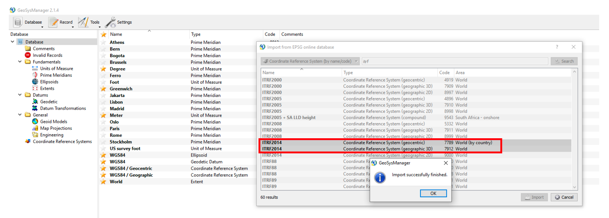

# Overview
RIEGL GeoSysManager is used to define the coordinate systems, datums, ellipsoids, map projections and transforms used during georeferencing activities. Here, data are imported and pre-processed in the ITRF2014 coordinate reference system (consistent with AUSPOS methods), and exported in the cartesian WGS 84 / UTM map projection system, enabling distortionless processing.
 
*Notes*:
 
i) the following is based on RIEGL GeoSysManager (64 bit) v2.1.8, and
 
ii) the following need only be undertaken **once per region of interest**.

# Methods
**1. New Database**
 
*Open GeoSysManager. Navigate to Database → New → Save As → [ROI].gsfx*
 
**2. Import ITRF2014 CRS (geocentric & geographic); EPSG: 7789, 7912**
 
Import two coordinate reference systems (code 7789 and code 7912).
 
*Record→ Import Coordinate Reference System → Search → Import*
 
These codes stay the same for each campaign
