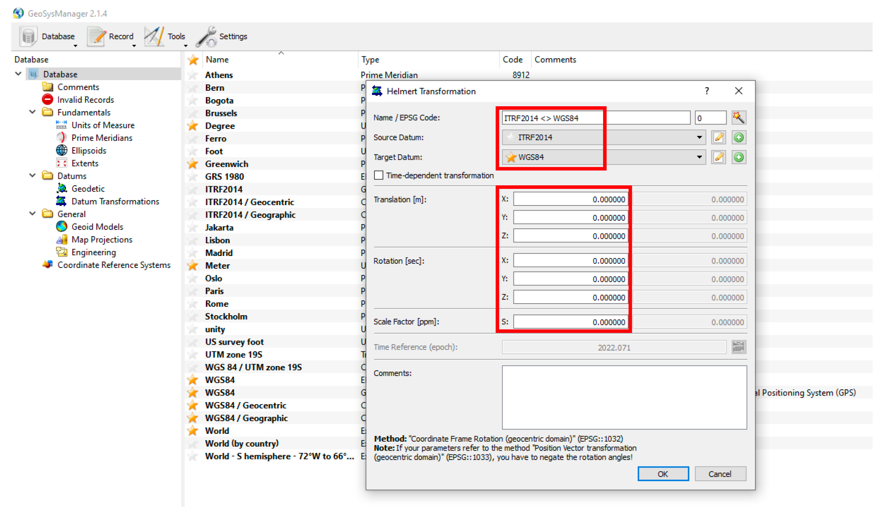

# Overview
RIEGL GeoSysManager is used to define the coordinate systems, datums, ellipsoids, map projections and transforms used during georeferencing activities. Here, data are imported and pre-processed in the ITRF2014 coordinate reference system (consistent with AUSPOS methods), and exported in the cartesian WGS 84 / UTM map projection system, enabling distortionless processing.

> The following is based on RIEGL GeoSysManager (64 bit) v2.1.8.
> The following need only be undertaken **once per region of interest**.

# Methods
**1. New Database**
 
*Open GeoSysManager. Navigate to Database → New → Save As → [ROI].gsfx*
  
**2. Import ITRF2014 CRS (geocentric & geographic); EPSG: 7789, 7912**
 
Import two coordinate reference systems (code 7789 and code 7912).
 
*Record→ Import Coordinate Reference System → Search → Import*
 
These codes stay the same for each campaign
  

**3. Import WGS 84 / UTM projection**
 
First it is necessary to determine which UTM zone the data were collected in, using a tool such as What UTM Zone am I in? So for example, the UTM zone for the data collected in 0003PE (Camino Verde, Peru), is 19S (i.e., EPSG:32719).
 
*Record → Import Coordinate Reference System → Search → Import*
  

**4. Create ITRF2014 <> WGS84 transformation**
 
ITRF2014 and WGS84 are likely to agree at the centimetre level, yielding conventional 0-transformation parameters. Thus, there are no official transformation parameters.
 
*Record → New Helmert Transformation → ITRF2014 to WGS84*
  

**5. Save Database**
 
*Database → Save*
