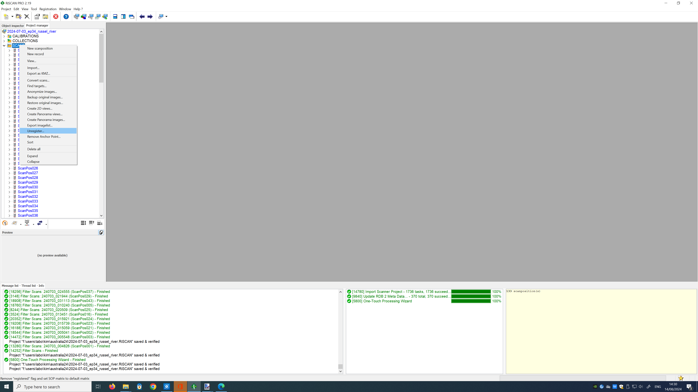
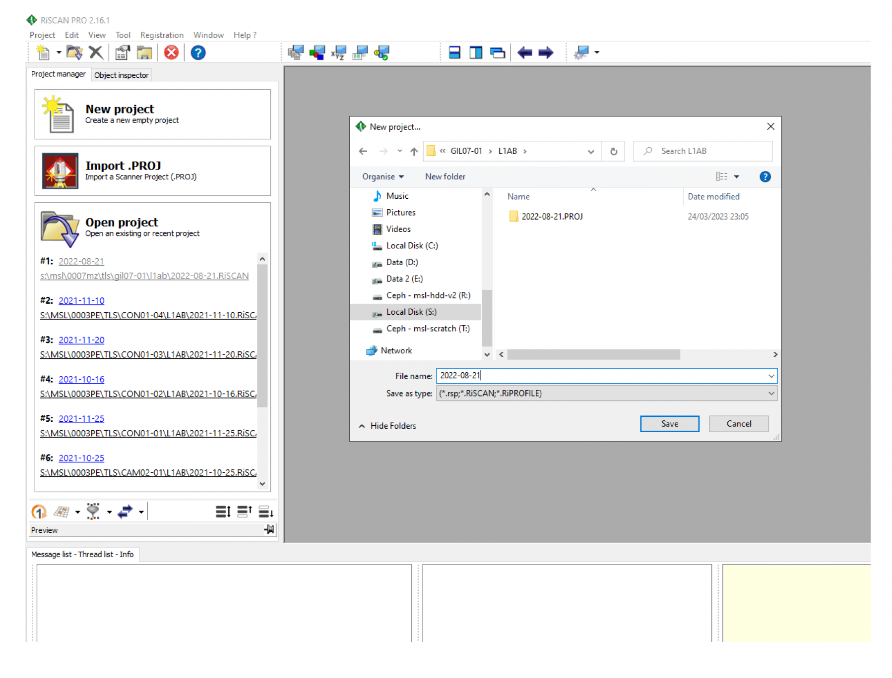
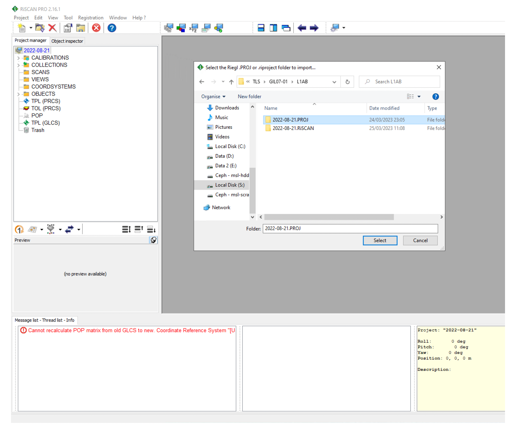

# Overview
The Automatic Registration 2 module is used to undertake an initial and coarse co-registration of the individual scans into the same coordinate system. The data used are: 
* the RTK-corrected observations collected from the onboard GNSS receiver
* inertial measurements collected from the onboard IMU
* planes derived from voxels generated across the point clouds themselves. 
The GNSS/IMU data provide an initial solution on the 3D position of the scanner, itself further refined using plane-to-plane matching.
  

# Methods
**1. Unregister any prior registration**
*R-click on scans → Unregister*
 
No ScanPos should have a green circle next to it anymore

  

**2. New project**
 
Open RiScanPro. Create a new project in the same  folder as where the .PROJ folder is: New project → give it same name as .PROJ
  

**3. Coordinate Reference Systems**
 
*Edit→ Attributes… → Coordinate Reference Systems*
 
* Database file:
    * [database created in previous step].gsfx
* Import:
    * CRS: ITRF2014 / Geographic
    * Datum Transformation: none
* RiPROCESS GLCS: 
    * GCRS: ITRF2014 / Geocentric
* Export:
    * Datum Transformation: ITRF2014 <> WGS84
    * CRS: WGS 84 / relevant UTM zone (e.g., WGS 84 / UTM zone 19S)
  

Note: This error occurs when doing the above CRS settings (see screenshots below too):
  

**4. Import raw TLS data**
1. *Help → Wizard ‘Download and Convert’ → Select associated .PROJ*
2. *Coordinate Reference Systems → Confirm above settings are correct*
3. *Reflector Estimation Settings → Ignore*
4. *Integrate*
  

  
