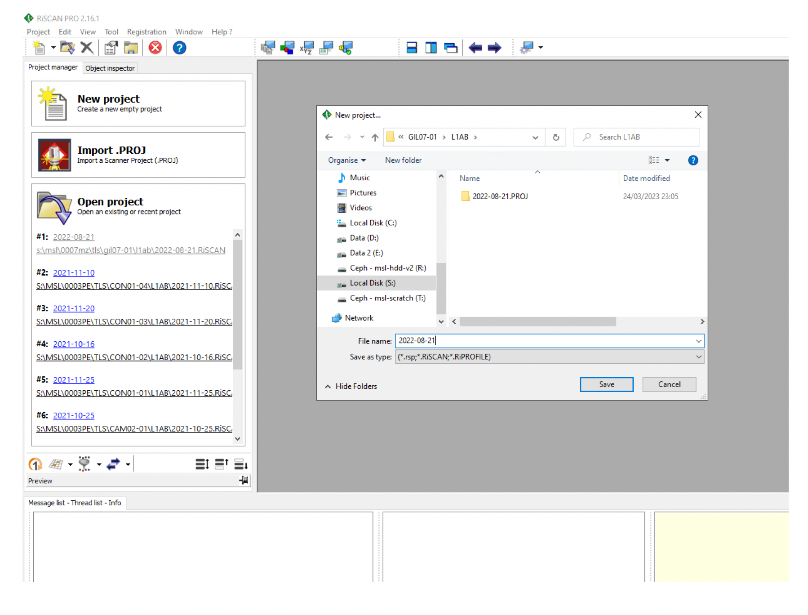

# Overview
RiEGL RiSCAN Pro is used to construct co-registered and georeferenced point clouds from raw TLS individual scan data aquired across any given plot (typically comprising 242 scans per ha), and then export them in the desired format. This first section focuses on defining the correct project settings, including correct coordinate systems, as well as the initial import and unpacking of the data.
  
*Notes*:
 
i) the following is based on RIEGL RiSCAN Pro v2.19

# Methods
**1. Copy the .PROJ folder on a HD from the computer (it is better to not work on an external HD or cloud storage)**
  
**2. New project**
 
Open RiScanPro. Create a new project in the same  folder as where the .PROJ folder is: New project → give it same name as .PROJ
  

**3. Coordinate Reference Systems**
 
*Edit→ Attributes… → Coordinate Reference Systems*
 
* Database file:
    *[database created in previous step].gsfx
* Import:
    *CRS: ITRF2014 / Geographic
    *Datum Transformation: none
* RiPROCESS GLCS: 
    *GCRS: ITRF2014 / Geocentric
* Export:
    *Datum Transformation: ITRF2014 <> WGS84
    *CRS: WGS 84 / relevant UTM zone (e.g., WGS 84 / UTM zone 19S)
  

Note: This error occurs when doing the above CRS settings (see screenshots below too):
  
