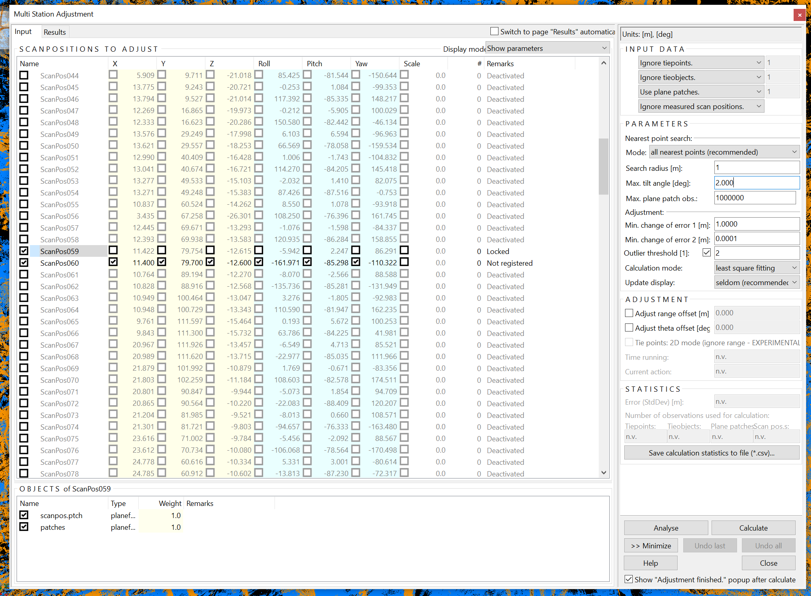
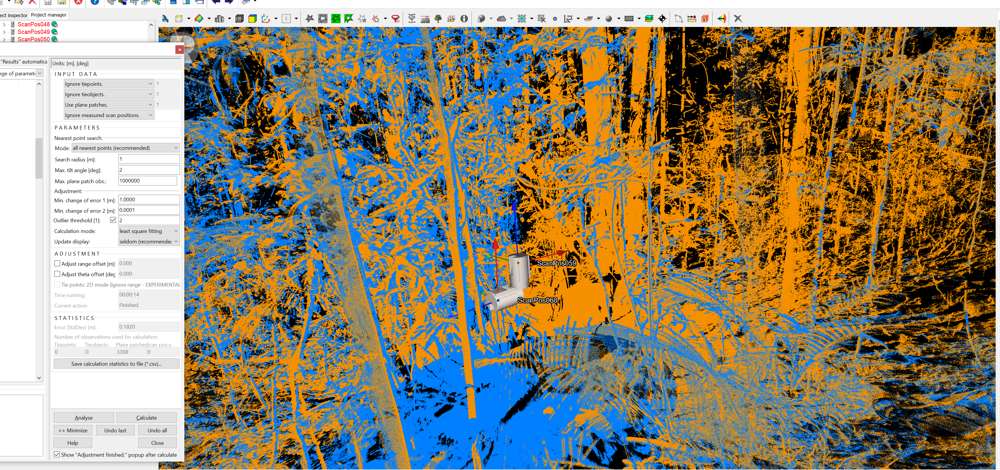
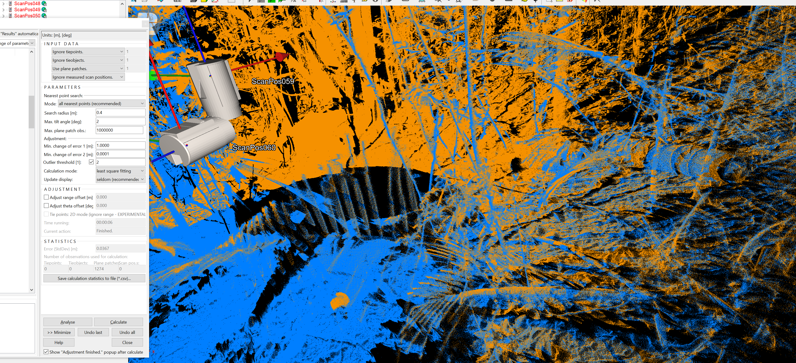
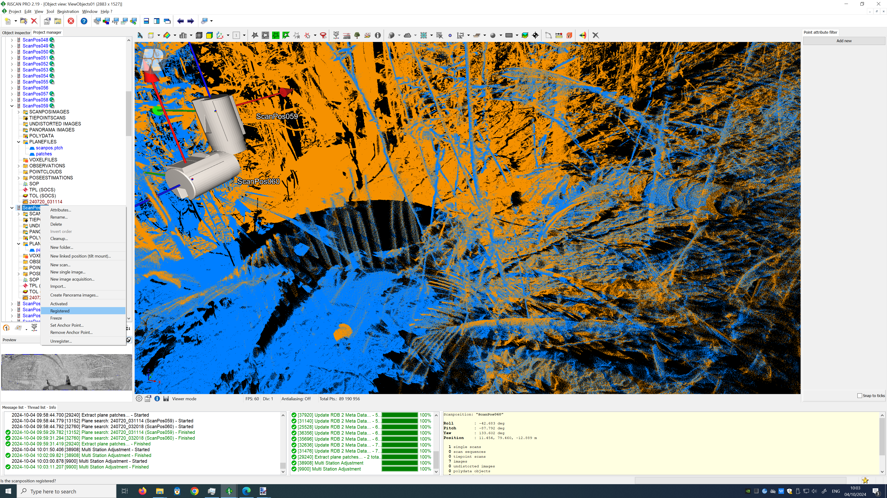

# Overview
The Automatic Registration 2 module is used to undertake an initial and coarse co-registration of the individual scans into the same coordinate system. The data used are: 
* the RTK-corrected observations collected from the onboard GNSS receiver
* inertial measurements collected from the onboard IMU
* planes derived from voxels generated across the point clouds themselves. 
The GNSS/IMU data provide an initial solution on the 3D position of the scanner, itself further refined using plane-to-plane matching.
  

# Methods
**1. Unregister any prior registration**
 
*R-click on scans → Unregister*
 
No ScanPos should have a green circle next to it anymore

  

**2. Delete bad scans**
 
Bad scans should be deleted. Every ScanPos should have only 1 scan in it. Bad scans can be caused by wind or scanner movement. The general rule is that the scan with the oldest timestamp is the correct. Check the field sheets if unsure.
 
No ScanPos should have a green circle next to it anymore

  

**3. Filter scans**
 
Open the One-Touch Processing Wizard
  
Check the box for *Filter Scans* and use the following settings:
* Keep all echoes per laser shot
* Delete all point with a reflectance below -20 dB
* Delete all point with a reflectance above 5 dB
* Delete all point with a deviation above 20 (the deviation filter can vary, but is generally in the 12 to 20 range). Make sure to document this value.

  

**4. Automatic Registration**
 
*Registration → Automatic Registration 2*
 
* Project scenario: Custom settings
* Voxel Size: 0.1 m
* Voxel Count: 1024
* Manual assistance: Never
* Scanner transportation: Carried manually

  

**5. Fix the Automatic Registration**
**5.1 Tilted scans through SOP manipulation**
 
After the Automated Registration, you will notice that a few scans are not registered (i.e. they will not have the green circle next to the ScanPos).
 

 
These are mostly tilted scans (they are harder to automatically register as they can be challenging for the IMU).
We fix those first using the following steps. Here we demonstrate it for up-tilt pair ScanPos59 (up, registered) and ScanPos60 (tilt, not registered):
  
1. *Open the SOP of the registered scan and write down the translation coordinates (the 4th column, one decimal precision is ok)*
  
2. *Open the SOP of the unregistered scan, and change the 3 translation coordinates to the ones from the registered scan. You will see that the scans already quite good now.*
  
  
3. *Extract plane patches for both scans now. Select them, right click → Extract plane patches*
  
  
4. *Use Multi Station Adjustment (registration → Multi Station Adjustment → Start adjustment) on the 2 scans. Only have those 2 scans activated, and lock the position and orientation of the up scan. We recommend to use the settings in the image below and start with a search radius of 1m. Click calculate to execute the first iteration of MSA*
  
5. *After the first iteration the registration should have improved. Now change the search radius to approximately 2 x error (stdDev). In our example, this is roughly 0.4*
  
  
6. *When the stdDev is below 0.1m, we consider this good enough for now. Generally this will already be the case after the second iteration of MSA*
7. *Rclick on the ScanPos and mark it as registered. A green circle will now appear next to the ScanPos*
  
