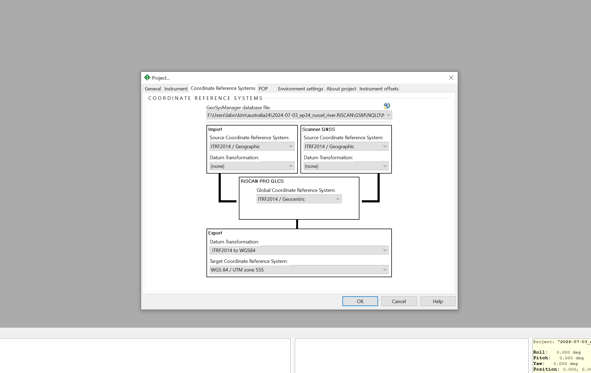

# Overview
The Automatic Registration 2 module is used to undertake an initial and coarse co-registration of the individual scans into the same coordinate system. The data used are: 
* the RTK-corrected observations collected from the onboard GNSS receiver
* inertial measurements collected from the onboard IMU
* planes derived from voxels generated across the point clouds themselves. 
The GNSS/IMU data provide an initial solution on the 3D position of the scanner, itself further refined using plane-to-plane matching.
  

# Methods
**1. Unregister any prior registration**
 
*R-click on scans → Unregister*
 
No ScanPos should have a green circle next to it anymore

  

**2. Delete bad scans**
 
Bad scans should be deleted. Every ScanPos should have only 1 scan in it. Bad scans can be caused by wind or scanner movement. The general rule is that the scan with the oldest timestamp is the correct. Check the field sheets if unsure.
 
No ScanPos should have a green circle next to it anymore

  

**3. Filter scans**
 
Open the One-Touch Processing Wizard
 
Check the box for *Filter Scans* and use the following settings
* Keep all echoes per laser shot
* Delete all point with a reflectance below -20 dB
* Delete all point with a reflectance above 5 dB
* Delete all point with a deviation above 20 (the deviation filter can vary, but is generally in the 12 to 20 range). Make sure to document this value.

  

**3. Coordinate Reference Systems**
 
*Edit→ Attributes… → Coordinate Reference Systems*
 
* Database file:
    * [database created in previous step].gsfx
* Import:
    * CRS: ITRF2014 / Geographic
    * Datum Transformation: none
* RiPROCESS GLCS: 
    * GCRS: ITRF2014 / Geocentric
* Export:
    * Datum Transformation: ITRF2014 <> WGS84
    * CRS: WGS 84 / relevant UTM zone (e.g., WGS 84 / UTM zone 19S)
  

Note: This error occurs when doing the above CRS settings (see screenshots below too):
  

**4. Import raw TLS data**
1. *Help → Wizard ‘Download and Convert’ → Select associated .PROJ*
2. *Coordinate Reference Systems → Confirm above settings are correct*
3. *Reflector Estimation Settings → Ignore*
4. *Integrate*
  

  
