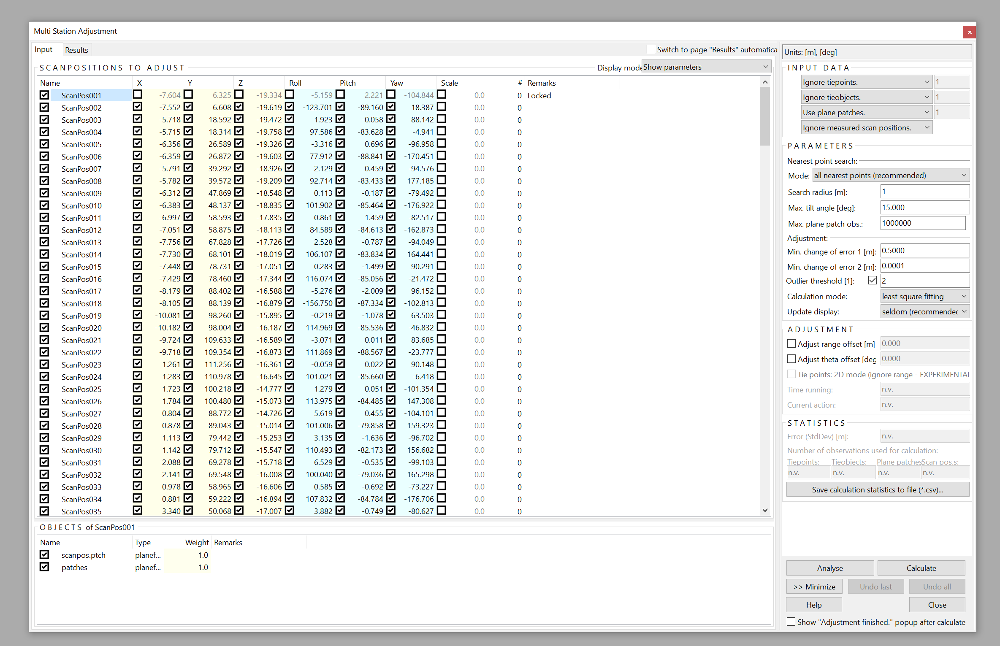
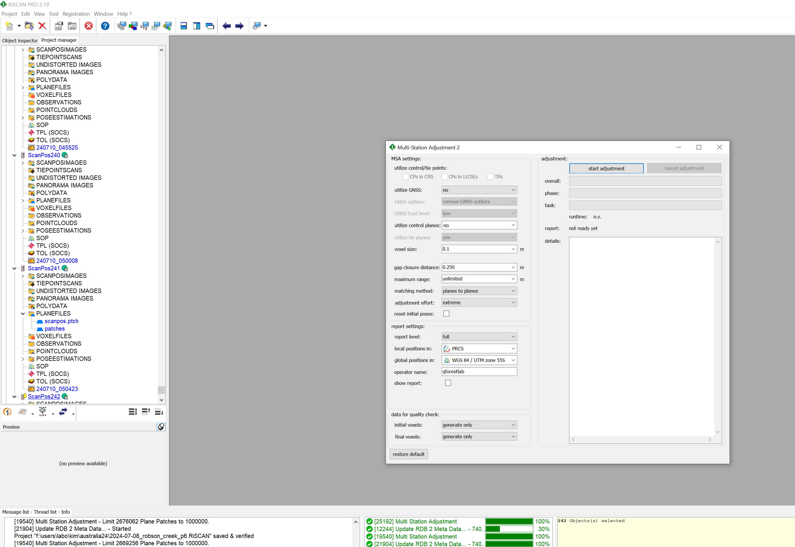

# Overview
In this step, we will do the final fine-scale registration. We will first run Multi Station Adjustment (MSA), followed by Multi Station Adjustment 2 (MSA2)
  

**1. Multi Station Adjustment (MSA)**
 
* Create plane patches for all the scans* 
*select one scan → click on the symbol to select all the scans (see image below for symbol to click) → Right click → Extract plane patches* 
    
* MSA 
*registration → Multi Station Adjustment → Start adjustment* 
Make sure all the scans are selected. You have to freeze one scan (generally ScanPos001). 
Generally, we will do multiple runs (mostly 2 is enough) until the Error (StDev) is below 0.1m. We suggest using a search radius of 1m for your first run (click *Calculate* to run). For your next run, the search radius should be 2x Error (StdDev). Stop when this error is smaller than 0.1m.
    

**2. Multi Station Adjustment 2 (MSA2)**
 
The MSA 2 module is used to refine the initial coarse co-registration that is
provided by the Automatic Registration 2 module. In the particular configuration
that will be used here, this is undertaken by matching planes generated from
every point cloud. That is, similar in approach to the Automatic Registration step,
except using all data rather than the daisy chain approach.
  
*Registration → Multi Station Adjustment 2 → Execute MSA 2*
  
   Set parameters and click *start adjustment*