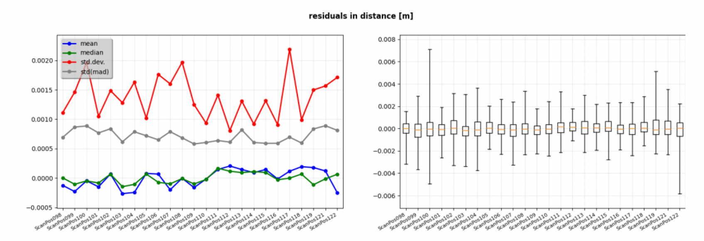
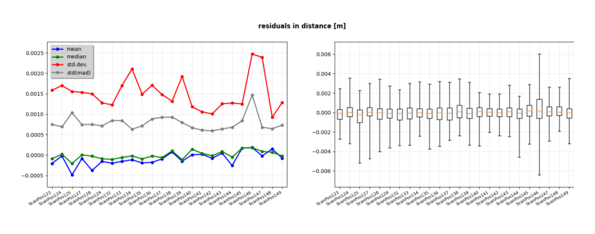
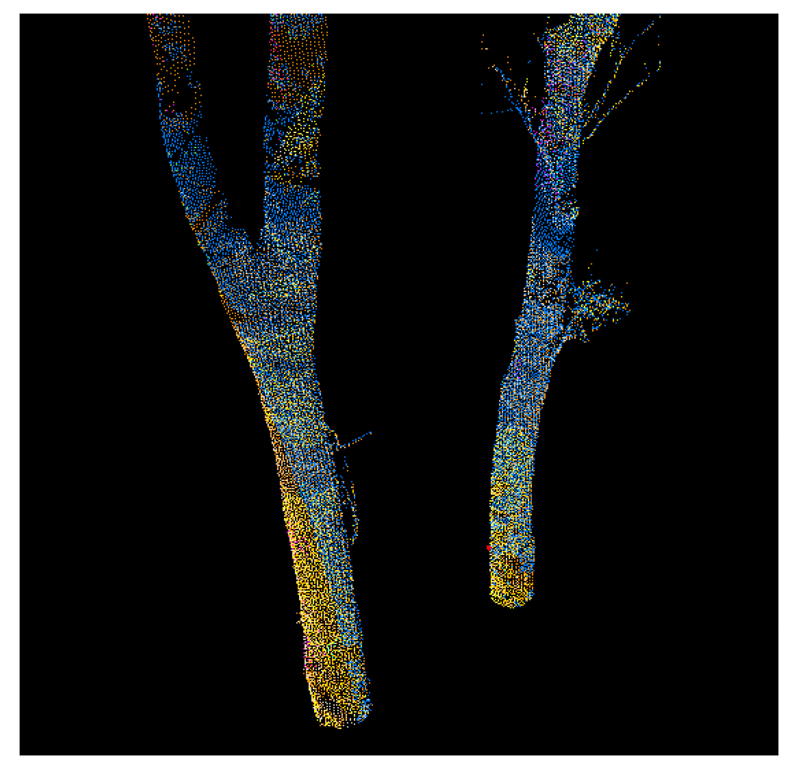
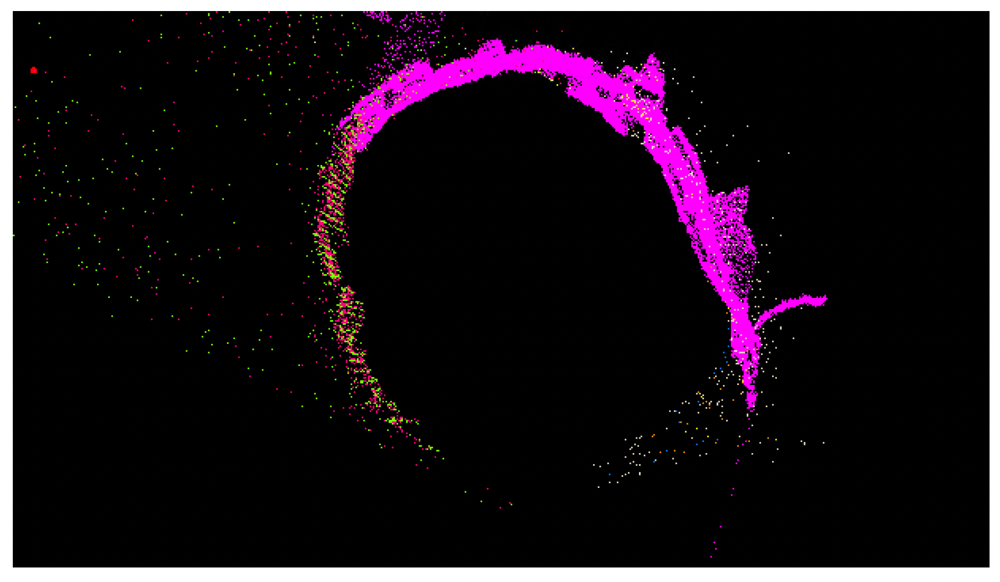
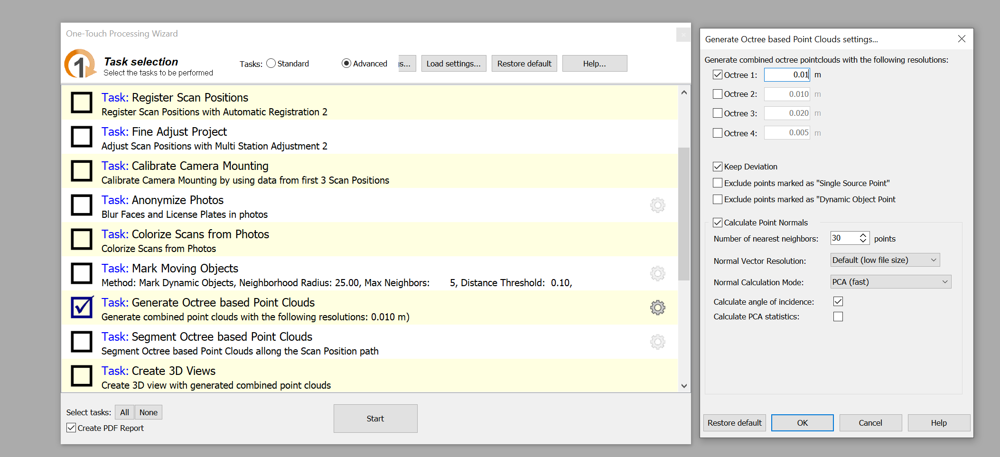
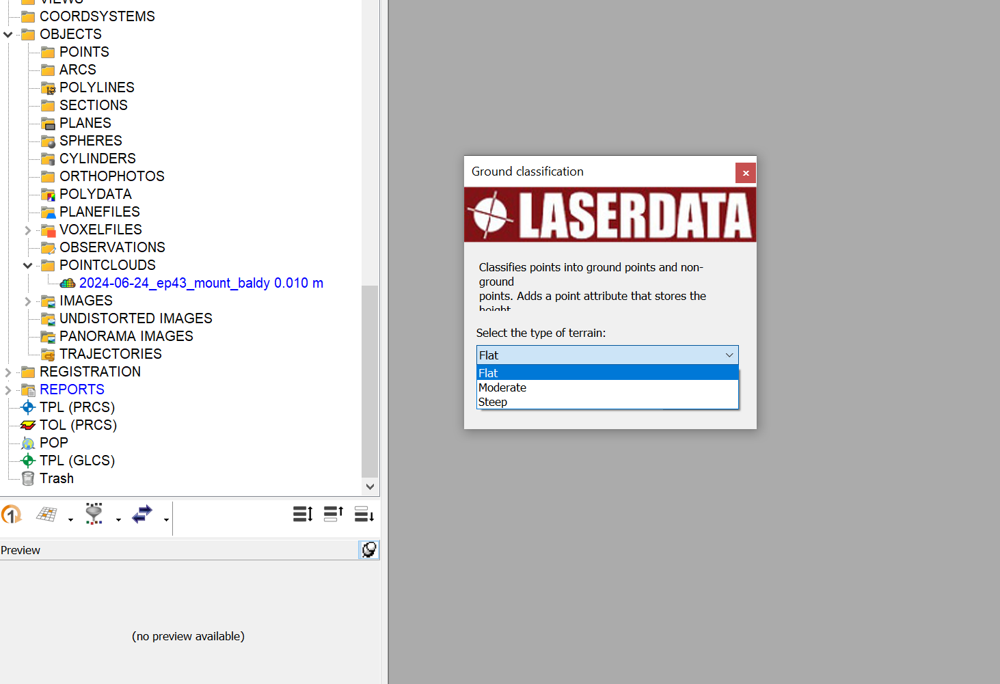
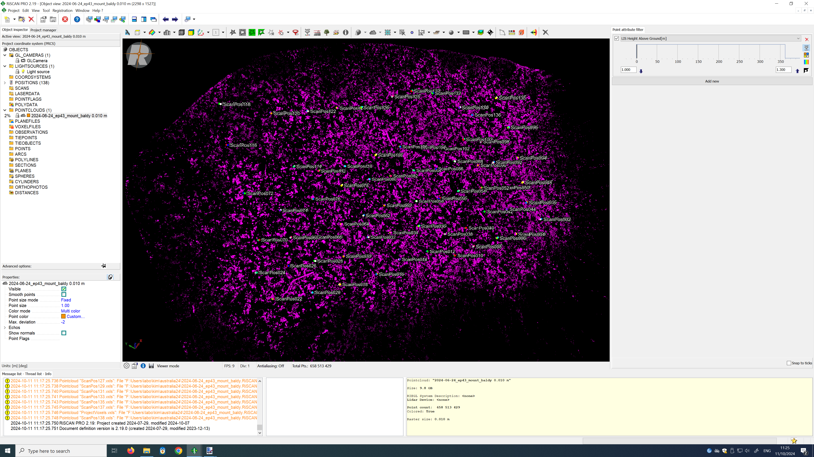
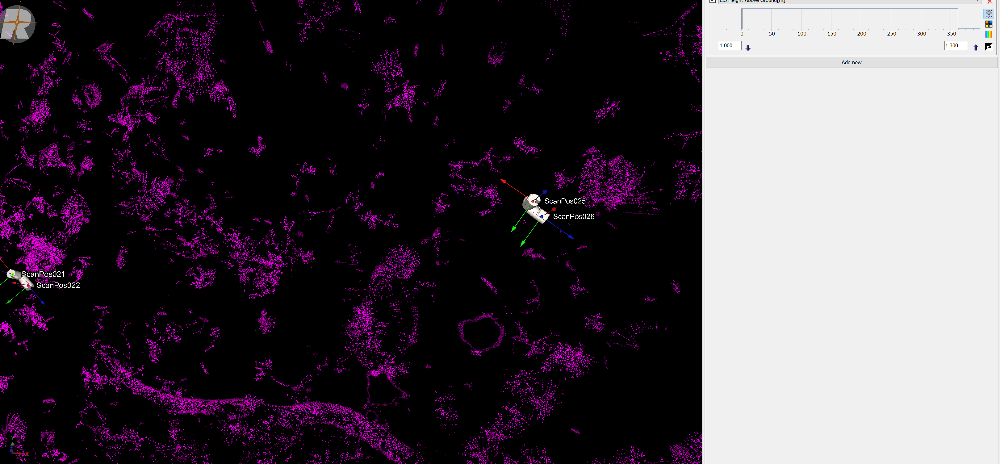
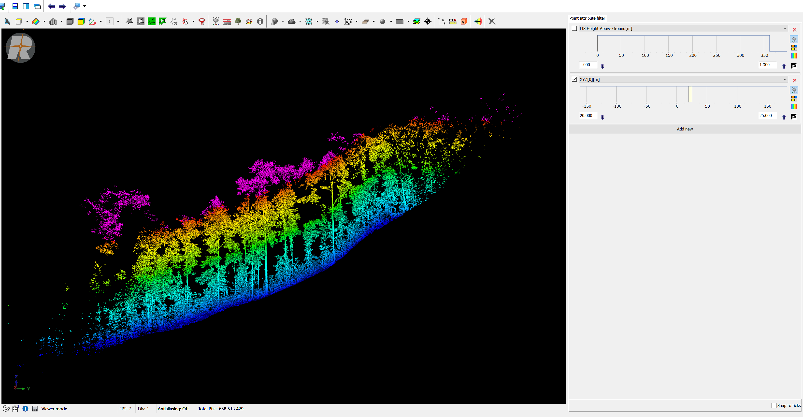

# Overview
The results of MSA + MSA2 are usually quite good, but a quick check is recommended to avoid spending time on instance segmentation of poor point clouds. 
The checks are two-fold:
 
i) Analysis of the MSA2 report
 
ii) Visual inspection of plot stems cross-section
  

**1. MSA2 report**
 
The results from MSA 2 are usually accurate, but occasionally individual scans
might be poorly co-registered. The starting point for identifying these scans is the
‘full report’ generated by MSA 2 module. These scans can then be viewed in 3D,
and the operator can decide whether they should be included or excluded.
  
i) Open the corresponding MSA 2 report and review section 4.4.2: Plane
Patches. What you are looking for are substantial spikes in the residuals of distance.
Typically when std(mad) > 0.0015 m. The first figure below is approximately
normal. The second shows a spike in ScanPos146, that requires investigation.
  
    
ii) Visualise the scan in question, and neighbouring scans (e.g., in the above
example, 143-150), and colour them by unique values. Switch view type →
Switch to Single color mode. You are trying to identify if the scan position is poorly
registered. This can perhaps most readily be found by looking at crosssections
of the point cloud (e.g., using the Height Filter). Particularly focus on
the stems and low-order branches, checking to see if there is any duplication of ghosting
of surfaces. It can be difficult to distinguish between co-registration errors and
effects from wind for high-order branches higher up in the canopy.
  
   
iii) If a scan is considered poorly-registered by the operator, then it should be
excluded from the project: *R-click ScanPosXXX → Unregister* (this is not the same
as toggling the ‘registered’ flag)
    
**2. Visual inspection of plot stems cross-section**
 
i) Make an octree pointcloud including all the scans. Typically, we downsample to 1cm for this with the following settings in the One-Touch Processing Wizard:
    
ii) Now we will calculate the height above terrain for each point (this is different than the Z-value).  
*Right click on the created octree point cloud → LIS Tree Analyzer Tools → Ground Classifier* 
Select the option that best matche the terrain of the plot:
    
iii) Visualise the octree point cloud and us the "Point attribute filter" to display a cross section, using "LIS Height Above Ground" as a visual filter. Typically you would take a slice of 0.3m, eg 1-1.3m above terrein. Drag in the locations of the ScanPos too:
    
iv) Zoom in closer and navigate through the whole plot, visually looking for indications of mis-registration. The easiest is to follow the ScanPos order
    
v) Finally, we will inspect a vertical cross section of the plot. Disable the point attribute filter "LIS Height Above Ground" and initiate the filter on x (XYZ[0]) or y (XYZ[1]). In this example we display a 5m transect using a filter on the x-coordinate
    