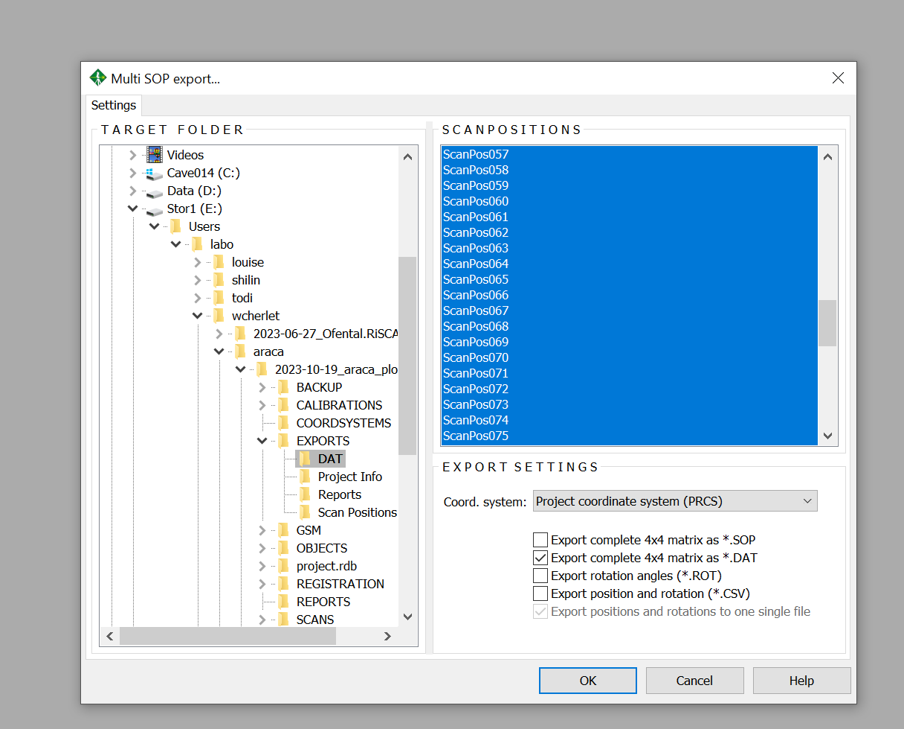
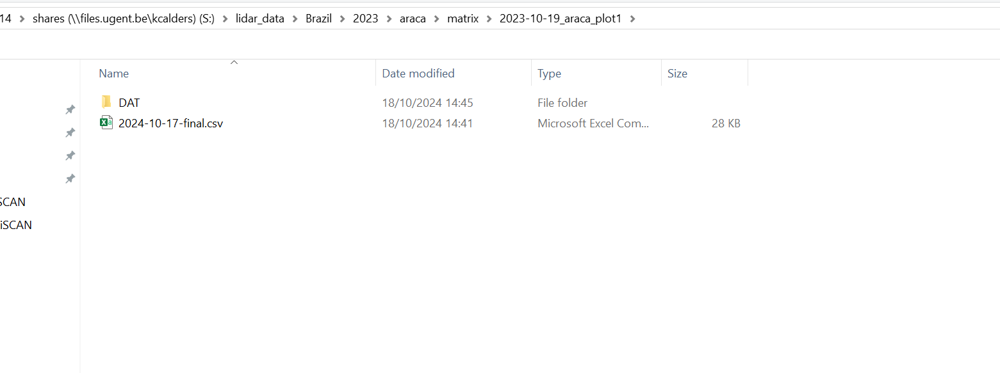

# Overview
Finally, we will export and backup the SOP (as *.DAT) and registration so the project can be easily recreated in the future without having to store the fill RiSCAN project.
  

**1. SOP project backup**
 
*registration → SOP backup* 
We suggest a naming convention with export data and -final.
    

**2. Multiple SOP backup**
 
*registration → SOP backup* 
Export them as *DAT files in the PRCS
    

**3. Copy to datatransfer share**
 
* Organise the output of step 1 and 2 in a folder with the same name as the *PROJ. In this example this is the backup for the 2023-10-19_araca_plot_1.  
* Log on to the shares (\\files.ugent.be\[username]), and put this ready on the share *lidar_data_management* 
* Contact the data manager (Louise Terryn) when these matrix backups are ready to be transported to the lidar archive 
    
