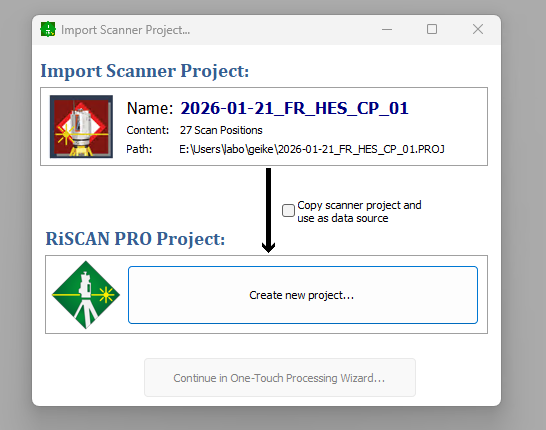
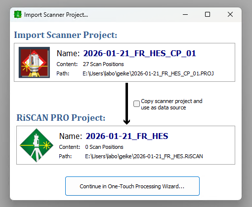
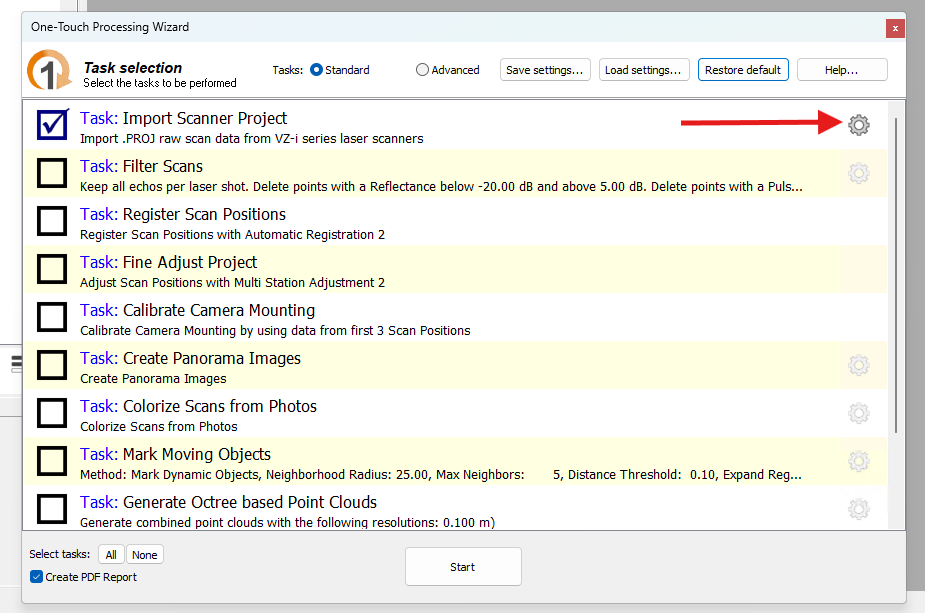
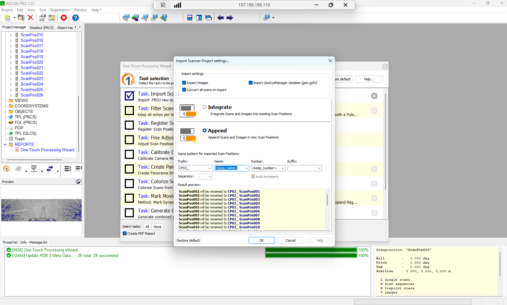
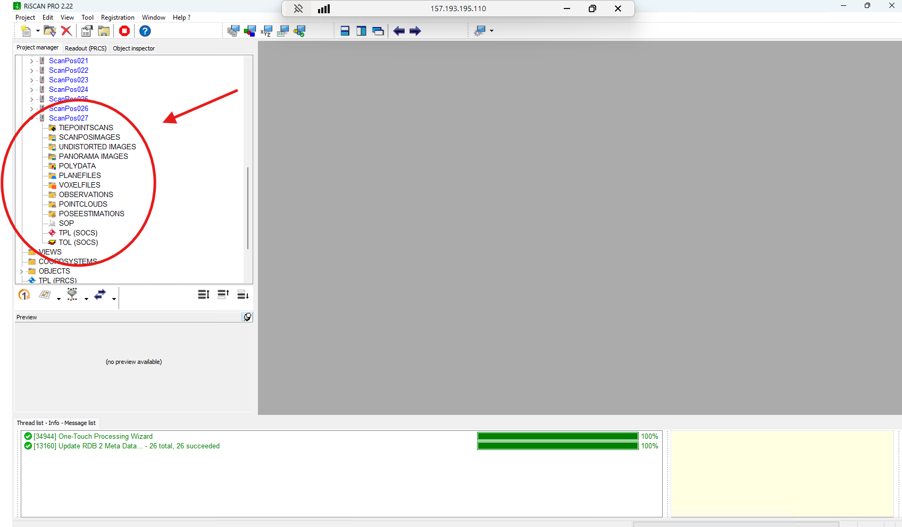
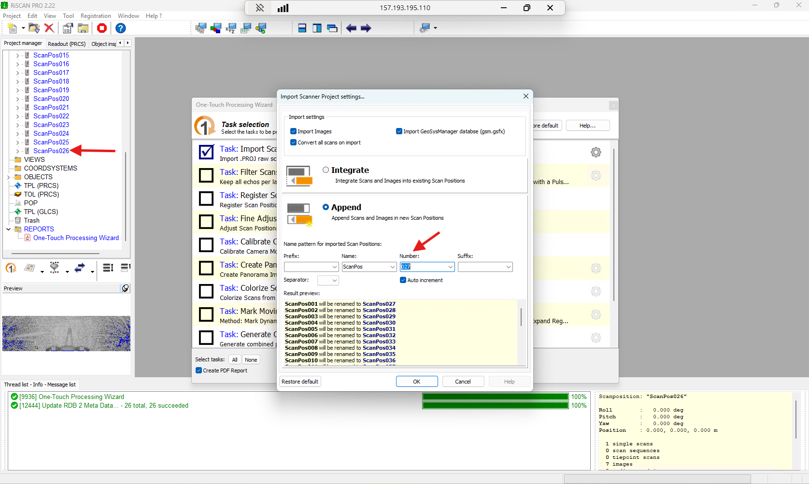
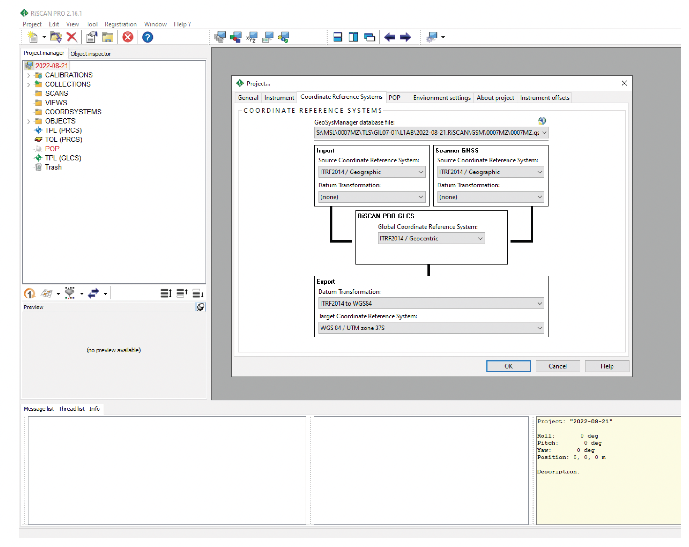

# Overview
You scan multiple plots in different scanner projects (.PROJ). When the plots and their respective scanpositions 
have overlap (e.g. one site has multiple subplots close to each other, with the scan grids clearly overlapping), you can import and register the different scanner projects into one RiSCAN PRO project.

> The following is based on RIEGL RiSCAN PRO v2.23

# Methods
**1. Copy the .PROJ folders on a HD from the computer**

**2. Determine the order of the plots**
It is important to determine the order in which you want to import the plots. Sufficient overlap between plots is necessary for registration.

Example 1:
Plot 1 has overlap with Plot 2 but not Plot 3, Plot 2 has overlap with both Plot 1 and Plot 3.
Order: Plot 1 → Plot 2 → Plot 3

Example 2: 
Plot 1 has overlap with Plot 3. Plot 3 has overlap with Plot 2. Plot 2 has overlap with both Plot 3 and Plot 4. Plot 4 has overlap with Plot 2.
Order: Plot 1 → Plot 3 → Plot 2 → Plot 4

**3. Import 1st scanner project and create new RiSCAN PRO project**
 
1. Open RiSCAN PRO. Go to your file explorer and drag the first .PROJ file and drop it into RiSCAN PRO.
2.*"Create new project... → Choose appropriate folder and project name → Save → Continue in one-touch processing wizard...*
  

  

3. *"Settings"*
  

5. *"Append"*
Choose appropriate settings. You can for example choose a prefix/suffix "insert_your_plotname" and a seperator "_" to be added to your Scan Positions.
  

**!Careful!** Scan Positions will be ordered alphabetically or numerically in order. Example: If you have a mixed plot order eg Plot 4 → Plot 2 → Plot 1 → Plot 3, **do not add pre-/suffixes!**

7.  *Check all the boxes → Close settings → "Start"*

**4. Add next scanner project to the RiSCAN PRO project**
1. Sometimes the scanner will have made an empty ScanPos at the end. Delete this ScanPos: *Right click on ScanPosXX → Delete → Yes*.
  

2. Go to your file explorer and drag the second .PROJ file and drop it into RiSCAN PRO.
3.*"Continue in one-touch processing wizard..."*
  

4. *"Settings"*
  

6. *"Append"* 
Choose appropriate settings. Preferably, choose the option ScanPos001 → ScanPosXXX (XXX dependent on how many were in your first project), this should be selected automatically. If you chose to work with pre-/suffix, you can continue this way.
  

  

**Make sure to keep track of all naming!**
7.  **Check all the boxes → Close settings → "Start"*

**5. Repeat step 4 until all plots are imported.**

**6. Coordinate Reference Systems**
Now set the CRS as you would do for normal registration. Importing before or after importing the .PROJ files should not have an effect.
*Edit→ Attributes… → Coordinate Reference Systems*
 
* Database file:
    * [database created in previous step].gsfx
* Import:
    * CRS: ITRF2014 / Geographic
    * Datum Transformation: none
* RiPROCESS GLCS: 
    * GCRS: ITRF2014 / Geocentric
* Export:
    * Datum Transformation: ITRF2014 <> WGS84
    * CRS: WGS 84 / relevant UTM zone (e.g., WGS 84 / UTM zone 19S)
  

**7. Registration**
> You now have two options. You can register the entire project at once (as you would normally) or you can do the processing in blocks.
1. Follow steps 3-6 in the [VZ400i registration manual](https://github.com/qforestlab/riscan_registration).

_OR_
2. Block processing as explained by RIEGL:

  1. Automatic registration is performed of a first block of the project (e.g. subproject 1)
  2. MSA2 is performed for the first block of the project (e.g. subproject 1)
  3. If the results meet your requirements, freeze the SOPs of all scan positions of this first block. This will fix these positions and they cannot be moved by AR2 or MSA2 anymore.
  4. Remove the registration flag for all scan positions which have no overlap to the next block you would like to register.
  5. Run AR2 on the next block now. AR2 will use the scan positions of the previous block, which have still the registration flag, but not move them. This will ensure that the new block is registered to the previous one.
  6. MSA2 is performed on the new block, whereas the scan positions of the previous block, which have still the registration flag, will aid MSA2 to improve registration between the current and previous block.
  7. Repeat 4-7 until the whole project is registered
  8. Set the registration flag for all scan positions and remove the freeze flag
  9. **IMPORTANT**
  In case control points shall be used in the project you must ensure that when doing a block adjustment after linking the control points to your fine scanned targets, no scan position has then freeze flag active and all registered scan positions have the registration flag active. Only the perform the block adjustment.
  This is mandatory, as only scan positions which are set to registered and where the SOP is not frozen are moved. Frozen and unregistered positions are staying where they are.
  So, if you forget to set this correctly, it can tear the project apart.

